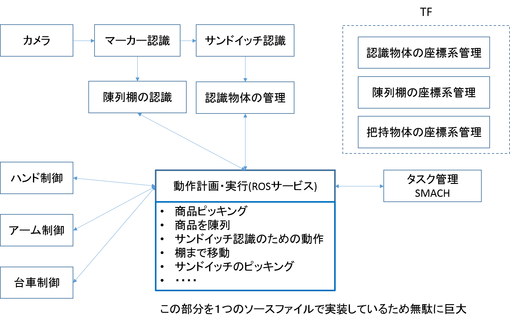
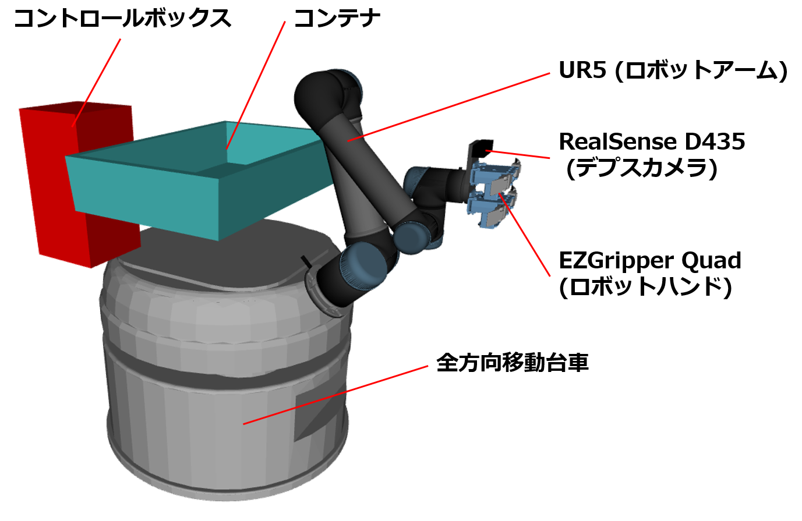

FCSC パッケージ群
==============================================

## はじめに
2018年度 World Robot Summit(WRS) の Future Convenience Store Contest(FCSC) の商品陳列・廃棄品回収競技に参加したときに使用したプログラム．
競技ではおにぎり、ドリンク、弁当を陳列棚の指定場所に陳列作業、陳列棚に乱雑に置かれたサンドイッチから指定のサンドイッチを回収する廃棄品回収作業、残りのサンドイッチを陳列棚に整列させるフェイスアップ作業を行った．

## ROSノードのシステム構成


## ロボットのシステム構成


*  UR5  
垂直多関節型、６自由度．
最大リーチ850[mm]

* EZGripper Quad  
４本指のロボットハンド．　　
各指の関節は２自由度．
第２関節が劣駆動になっており、物体の形状に合うように曲がる．

* RealSense D435  
サンドイッチ、陳列棚に貼り付けたARマーカを見て物体の位置・姿勢を取得するのに使用．

* 全方向移動台車

* コンテナ  
対象商品を格納して運搬するのに使用

* コントロールボックス(UR5用)

## 各パッケージの説明
詳細はパッケージごとのREADME.mdを参照すること．

### fcsc_description


### fcsc_gazebo


### fcsc_launch


### fcsc_moveit


### fcsc_msgs


### fcsc_perception

### fcsc_tf


## 設定方法

### ダウンロード
```
git clone https://github.com/takubolab/fcsc_pkgs.git
```

### 依存パッケージのインストール
```
cd fcsc_pkgs
sh ros-install-fcsc-packages.sh
```

RealSenseD435を使用するので，`librealsense2` および `realsense2_camera` パッケージが必要．  
`librealsense2`パッケージは [公式ページ](https://github.com/IntelRealSense/librealsense) の [マニュアル](https://github.com/IntelRealSense/librealsense/blob/master/doc/distribution_linux.md) に従って導入する．  
`realsense2_camera`は[このページ](https://github.com/intel-ros/realsense)に従って導入する．  
Ubuntu16.04のときは,｢sudo apt install ros-kinetic-ddynamic-reconfigure｣をインストールしておくこと.

#### timed_roslaunch
どのワークスペースに入れてもよい．
```
git clone -b $ROS_DISTRO-devel https://github.com/MoriKen254/timed_roslaunch.git
chmod +x ./timed_roslaunch/scripts/*
```

#### ur_modern_driver
`fcsc_pkgs`と同じワークススペース内でcloneする．
```
git clone -b kinetic-devel https://github.com/ros-industrial/ur_modern_driver.git
```

#### universal_robot
`fcsc_pkgs`と同じワークススペース内でcloneする．
```
git clone -b $ROS_DISTRO-devel https://github.com/ros-industrial/universal_robot.git
chmod +x ./universal_robot/ur_driver/cfg/*
```

#### roboticsgroup_gazebo_plugins
`fcsc_pkgs`と同じワークススペース内でcloneする．
```
git clone https://github.com/roboticsgroup/roboticsgroup_gazebo_plugins.git
```

#### gazebo_ros_link_attacher
`fcsc_pkgs`と同じワークススペース内でcloneする．
* indigo,kineticの場合
```
git clone https://github.com/pal-robotics/gazebo_ros_link_attacher.git
```

* melodicの場合
```
git clone -b melodic-devel https://github.com/pal-robotics/gazebo_ros_link_attacher.git
```

#### gmapping(Melodicのみ)
melodicでは gmapping 関連のパッケージがリリースされていないので自分でソースから入れる．
ダウンロードする場所はどのワークスペースでもよい．
```
git clone https://github.com/ros-perception/openslam_gmapping.git
git clone https://github.com/ros-perception/slam_gmapping.git
```

#### eband-local-planner(Melodicのみ)
```
git clone https://github.com/utexas-bwi/eband_local_planner.git
cd eband_local_planner
git fetch origin pull/33/head:master_pr33
git checkout master_pr33
chmod +x ./cfg/*
```

### パッケージ内の一部ファイルのパーミッションの設定
`sh fcsc-chmod.sh`

あとは通常どおり`catkin_make`を行う．  

## シミュレータ(Gazebo+MoveIt!)立ち上げ
以下のコマンドを実行する
```
roslaunch fcsc_launch daihen_ur5_simple_simulator.launch
```

## シミュレーター上での動作確認
### ロボットモデルの修正
現在、 Gazebo上に出した移動マニピュレータは移動中に倒れてしまうという問題がある．
モデルの重心位置や、慣性モーメントが正確でなかったりといろいろ原因が考えられるが、対処できていない．
そこで、台車が移動中に倒れないようにするための妥協案として、台車の底に巨大な平面リンク(1辺50mの正方形の板)を取り付ける必要がある．
通常はこの記述はコメントアウトしているので、必要なら以下の部分を有効化しておく．
`fcsc_description/model/daihen_ur5.urdf.xacro`内の36~46行目
```
<xacro:create_box name="plane" mass="1000" x="50" y="50" z="0.001" visual="false">
  <origin xyz="0 0 0.0005" rpy="0 0 0" />
</xacro:create_box>
<joint name="plane_fixed" type="fixed">
  <parent link="base_footprint"/>
  <child link="plane"/>
  <origin xyz="0 0 0" rpy="0 0 0"/>
</joint>
<gazebo reference="plane">
  <selfCollide>false</selfCollide>
</gazebo>
```
台車の底に平面リンクを取り付けているため、陳列棚といった地面に接地するようなモデルを出すと、台車の平面リンクとモデルが干渉してしまう．そのため、以下で実行するコマンドで陳列棚をGazeboに出すさい、陳列棚は地面から何cmか浮かしている．

### 必要なlaunchファイル立ち上げ
Gazebo上にロボットモデル、棚モデルを出して商品陳列作業・廃棄品回収作業を行う．  
ロボットモデル(Gazebo,MoveIt)、物体認識ノード、動作計画ノード、シミュレーター用の台車ナビゲーションノードを立ち上げる．  
`roslaunch fcsc_launch daihen_ur5_simulator.launch`  
Gazebo上にロボットモデルが出て、１０秒近く時間がたってから、ロボットアームが初期姿勢に移動する．  
棚モデルをGazeboに出す．  
`roslaunch fcsc_description spawn_two_shelves.launch`    
作業を開始する．  
`rosrun fcsc_moveit fcsc_smach.py`    
このコマンドでロボットが動き出し，陳列・廃棄作業を始める

## UR5と台車通信用のネットワーク接続設定
Ubuntuの画面右上にあるネットワークのアイコンをクリックする  
`接続を編集` -> `追加` -> `Ethernet`を選択して`作成` -> `IPv4設定`  
以下を入力  
* アドレス     192.168.1.[任意の数]
* ネットマスク  24
* ゲートウェイ  192.168.1.1  

入力したら接続を保存する

## 実機の立ち上げ
* UR5のドライバ起動  
`roslaunch fcsc_launch ur5_bringup_joint_limited.launch`

* EZGripperのドライバ起動  
`sudo chmod a+rw /dev/ttyUSB0`  
`roslaunch fcsc_launch ezgripper_bringup.launch `

* MoveIt!起動  
`roslaunch fcsc_launch fcsc_move_group.launch`

* 搬送台車の制御ノード立ち上げ  
`roslaunch comm_client CommClient.launch`  

* RealSenseD435接続  
`roslaunch fcsc_launch realsense_bringup.launch`  
RealSense Node Is Up!のメッセージが表示されているか確認する．
表示されていなれけばRealSenseが繋がっていないので，再度立ち上げる．

* 陳列商品の個数を設定
`/fcsc_perception/config/`にある`stocking_products.yaml`に陳列する、おにぎり、ドリンク、弁当の個数を入力する  

* 廃棄サンドイッチのIDを入力  
`/fcsc_perception/config/`にある`scrap_sandwich_id.yaml`に廃棄サンドイッチのIDを入力する

* RealSense，物体認識，tfなどの複数ノード立ち上げ  
もっと適切なlaunchファイルの名前を付けたい．
`roslanch fcsc_launch fcsc_other.launch`

* 陳列・廃棄作業で使用する各動作のサービスサーバ立ち上げ  
`rosrun fcsc_moveit smach_daihen_ur5_moveit_core`

## 陳列・廃棄作業の開始
* タイマー設定  
`rosrun fcsc_moveit minute_timer _min:=[残り時間（分）]`

* 作業開始  
`rosrun fcsc_moveit fcsc_smach.py`  
このコマンドでロボットが動き出し，陳列・廃棄作業を始める
# test
# fcsc
